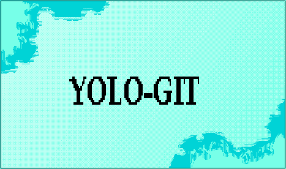

<p align="center"></p>

## Description

- (Intern Stuff Momentos)
- My latest new project. Some stuff that I archive about my intern stuff 😅

## Credit

- Images

```bash
Source: Freepik
Url: https://www.freepik.com
Search Format: Archive Logo
```

- Full UI

```bash
Source: Aceternity UI
Url: https://ui.aceternity.com
```

- Things that I used:

```bash
Source: React
Url: https://react.dev
```

```bash
Source: TailwindCSS
Url: https://tailwindcss.com
```

```bash
Source: Vite (For test-run)
Url: https://vitejs.dev
```

## <p align="center"></p>

# Security

- For security, please refer to the [SECURITY.md](SECURITY.md) file for more details.

# License

- This project is licensed under the [MIT License](LICENSE.md). Please refer to the [LICENSE.md](LICENSE.md) file for more details.
